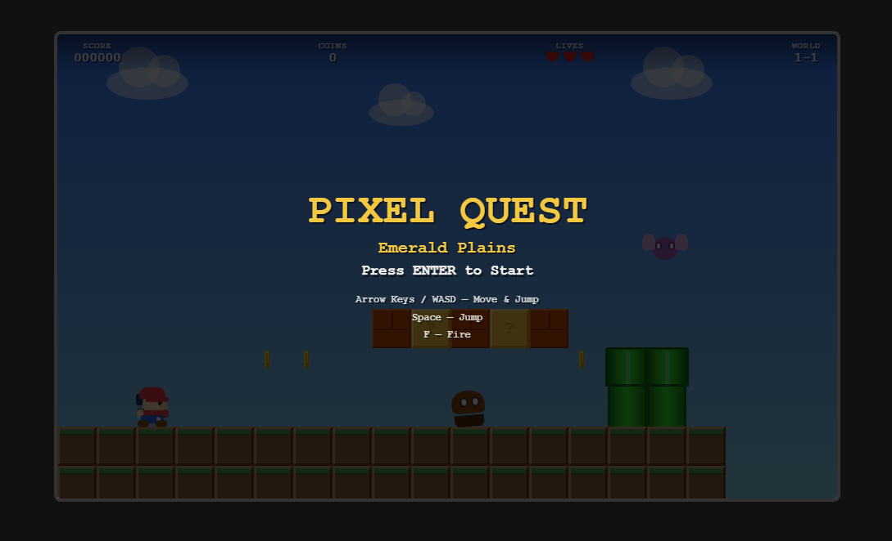
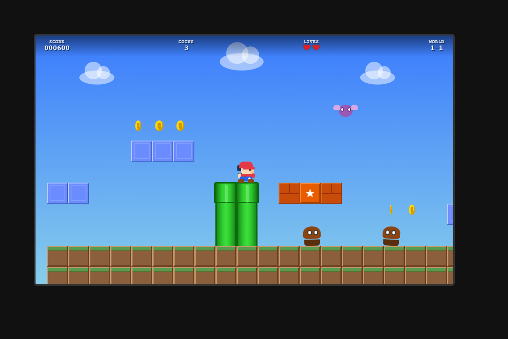
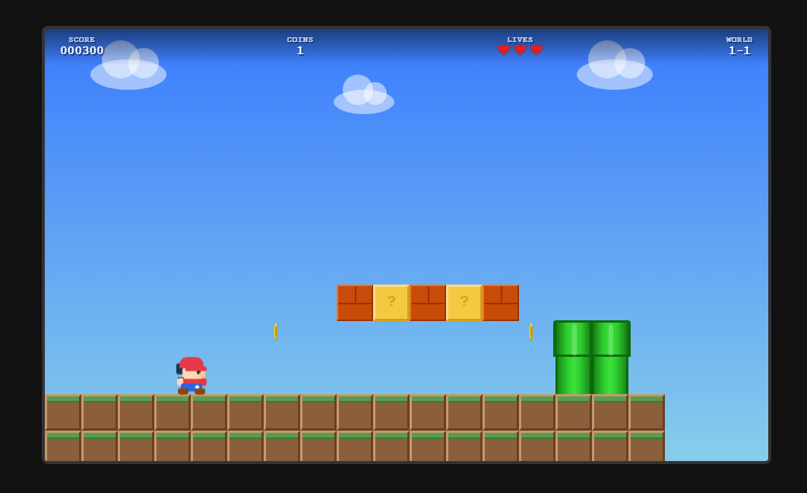
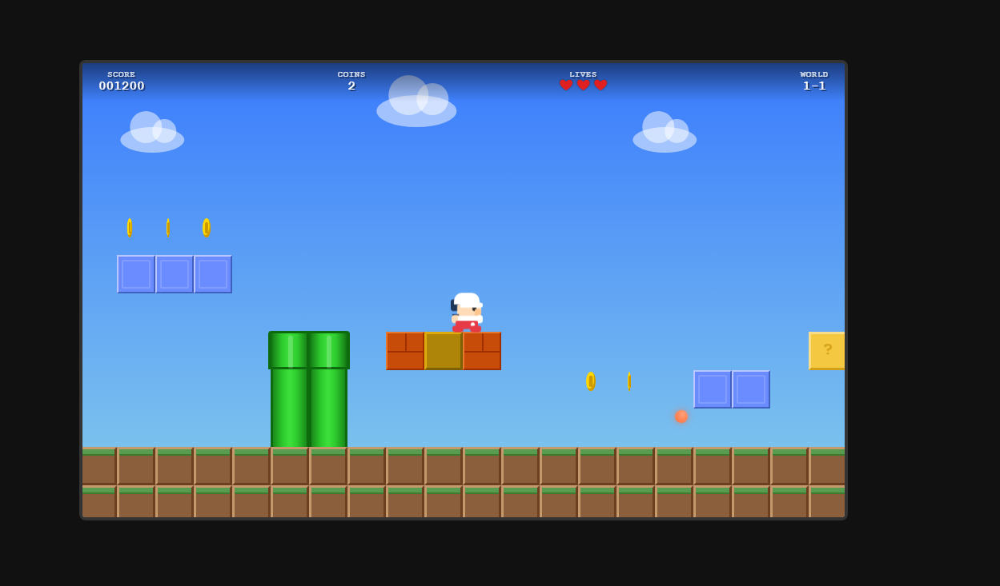
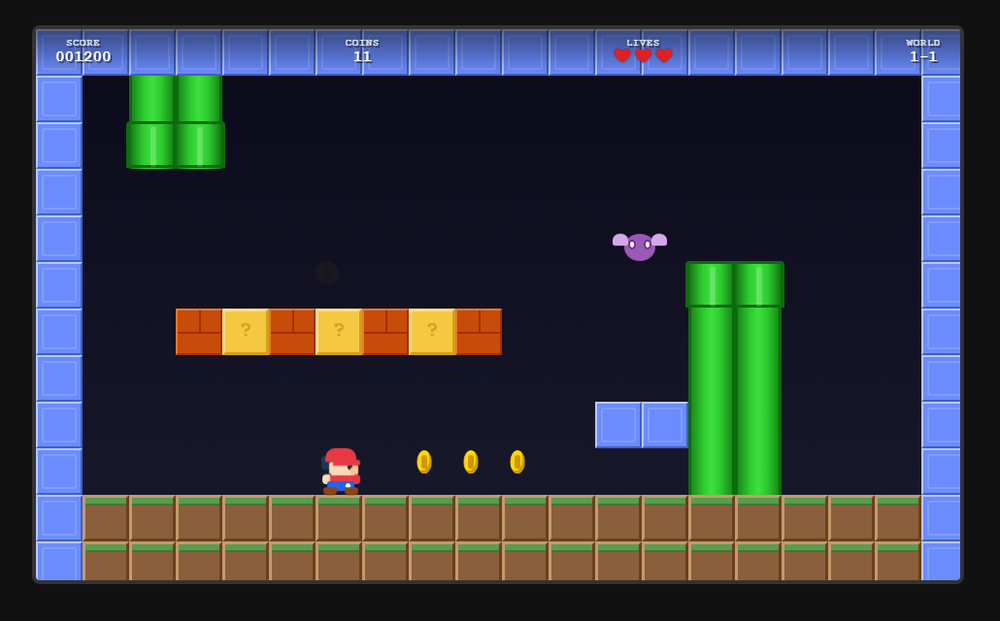

# Pixel Quest

A Super Mario Bros-inspired platformer built with React, TypeScript, and Vite. Pure CSS pixel art — no image assets or sprite sheets.




## 🎮 Controls

| Key | Action |
|-----|--------|
| **←** / **→** / **A** / **D** | Move left / right |
| **↓** / **S** | Crouch / Enter warp pipe |
| **Space** / **↑** / **W** | Jump (press again mid-air for double jump) |
| **F** | Shoot fireball (requires Fire Flower power-up) |
| **Enter** | Start game / Restart after win or game over |

## 🕹️ Gameplay

### Objective
Navigate through the level, collect coins, defeat enemies, and reach the flag pole at the end to win. Discover secret warp pipes to access hidden underground areas filled with bonus coins.

### Player Abilities
- **Walking & Running** — Move through the level with arrow keys
- **Jumping** — Press Space to jump; press again in mid-air for a **double jump**
- **Fireballs** — When the Fire Flower power-up is active, press F to shoot bouncing fireballs that defeat enemies on contact
- **Warp Pipes** — Stand on certain pipes and press **Down** to travel to secret underground areas

### Blocks
| Type | Description |
|------|-------------|
| **Ground** | Brown terrain blocks forming the level floor |
| **Bricks** | Breakable blocks (smash from below when big) |
| **? Blocks** | Hit from below to reveal coins or power-ups |
| **Multi-coin Blocks** | Dispense 5 coins on repeated hits, then shatter |
| **Solid Blocks** | Blue indestructible blocks |
| **Pipes** | Green pipes — some are warp pipes leading to secret areas |

### Power-ups
| Power-up | Effect |
|----------|--------|
| **Mushroom** | Makes Mario grow big; can break bricks |
| **Fire Flower** | Grants timed fireball ability (15s); changes Mario to white/red color scheme. Flashes when about to expire |

### Enemies
| Enemy | Behavior |
|-------|----------|
| **Goomba** | Walks back and forth on the ground. Defeat by jumping on top or with a fireball |
| **Flyer** | Bobs up and down in the air. Defeat by jumping on top or with a fireball |
| **Turtle** | Patrols the ground. Jump on it to turn it into a fast-sliding shell. The shell rebounds off walls up to 3 times and destroys any enemies it hits. A sliding shell damages the player on contact. Jump on the sliding shell to destroy it. Fireballs also convert turtles into shells |

### Warp Pipes
Certain pipes in the level are warp pipes. Stand on top of them and press **Down** to enter. You'll be transported to a secret underground area with bonus coins and enemies. Find the exit pipe in the underground to return to the overworld further ahead in the level.

### Scoring
| Action | Points |
|--------|--------|
| Coin pickup | 100 |
| Power-up pickup | 500 |
| Enemy defeat | 100 |
| Flag pole | 1,000 |

### Flag Pole Sequence
When Mario reaches the flag pole, he grabs on and slides down with the flag. After landing, he auto-walks past the pole before the victory screen appears.

## 🏗️ Tech Stack

- **React 18** — Component-based UI
- **TypeScript** — Full type safety across the codebase
- **Vite** — Fast dev server and build tool
- **SCSS** — Styling with variables, mixins, and nesting
- **Pure CSS pixel art** — All characters, enemies, and objects are rendered with CSS (no images)

## 📁 Project Structure

```
src/
├── components/       # React components (Game, Player, Enemy, Coin, etc.)
├── config/
│   └── constants.ts  # Central game tuning (physics, sizes, timing)
├── data/
│   └── level1.ts     # Level maps (overworld + underground), enemy/coin spawns, warp pipes
├── hooks/
│   ├── useGameState.ts  # Core game logic (physics, collisions, zone management)
│   └── useInput.ts      # Keyboard input handling
├── styles/           # SCSS files for all components
└── utils/
    ├── collision.ts  # AABB overlap & penetration helpers
    └── physics.ts    # Zone-aware tile lookups & solid tile checks
```

## 🚀 Getting Started

```bash
# Install dependencies
npm install

# Start dev server
npm run dev

# Build for production
npm run build

# Preview production build
npm run preview
```

## 📐 Game Constants

Key values can be tuned in `src/config/constants.ts`:

- **Viewport**: 960×576px (responsive scaling on smaller screens)
- **Tile size**: 48×48px
- **Jump force**: -14 (double jump: -11)
- **Player speed**: 4.5 px/frame
- **Fire power duration**: 15 seconds
- **Multi-coin blocks**: 5 coins each
- **Starting lives**: 3

## 📱 Responsive

The game automatically scales down to fit smaller screens while maintaining the native 960×576 resolution. The internal game logic is unaffected — only the visual display scales.


## 🖼️ Screenshots






