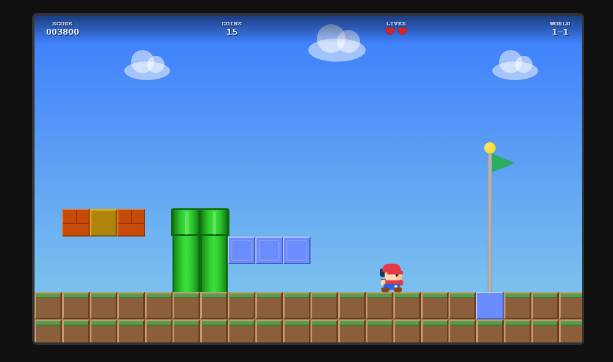

# Pixel Quest

A Super Mario Bros-inspired platformer built with React and Vite. Pure CSS pixel art — no image assets or sprite sheets.


## 🎮 Controls

| Key | Action |
|-----|--------|
| **←** / **→** /   **A** / **D** | Move left / right |
| **Space** / **↑** / **W** | Jump (press again mid-air for double jump) |
| **F** | Shoot fireball (requires Fire Flower power-up) |
| **Enter** | Start game / Restart after win or game over |

## 🕹️ Gameplay

### Objective
Navigate through the level, collect coins, defeat enemies, and reach the flag pole at the end to win.

### Player Abilities
- **Walking & Running** — Move through the level with arrow keys
- **Jumping** — Press Space to jump; press again in mid-air for a **double jump**
- **Fireballs** — When the Fire Flower power-up is active, press F to shoot bouncing fireballs that defeat enemies on contact

### Blocks
| Type | Description |
|------|-------------|
| **Ground** | Brown terrain blocks forming the level floor |
| **Bricks** | Breakable blocks (smash from below when big) |
| **? Blocks** | Hit from below to reveal coins or power-ups |
| **Multi-coin Blocks** | Dispense 5 coins on repeated hits, then shatter |
| **Solid Blocks** | Blue indestructible blocks |
| **Pipes** | Green pipes — solid obstacles to jump over |

### Power-ups
| Power-up | Effect |
|----------|--------|
| **Mushroom** | Makes Mario grow big; can break bricks |
| **Fire Flower** | Grants timed fireball ability (15s); changes Mario to white/red color scheme. Flashes when about to expire |

### Enemies
| Enemy | Behavior |
|-------|----------|
| **Goomba** | Walks back and forth on the ground. Defeat by jumping on top or with a fireball |
| **Flyer** | Bobs up and down in the air. Defeat by jumping on top or with a fireball |

### Scoring
| Action | Points |
|--------|--------|
| Coin pickup | 100 |
| Power-up pickup | 500 |
| Enemy defeat | 100 |
| Flag pole | 1,000 |

### Flag Pole Sequence
When Mario reaches the flag pole, he grabs on and slides down with the flag. After landing, he auto-walks past the pole before the victory screen appears.

## 🏗️ Tech Stack

- **React 18** — Component-based UI
- **Vite** — Fast dev server and build tool
- **SCSS** — Styling with variables, mixins, and nesting
- **Pure CSS pixel art** — All characters, enemies, and objects are rendered with CSS (no images)

## 📁 Project Structure

```
src/
├── components/       # React components (Game, Player, Enemy, Coin, etc.)
├── config/
│   └── constants.js  # Central game tuning (physics, sizes, timing)
├── data/
│   └── level1.js     # Level map, enemy/coin spawns, flag position
├── hooks/
│   ├── useGameState.js  # Core game logic (physics, collisions, state)
│   ├── useGameLoop.js   # requestAnimationFrame loop
│   └── useInput.js      # Keyboard input handling
├── styles/           # SCSS files for all components
└── utils/
    ├── collision.js  # AABB overlap & penetration helpers
    └── physics.js    # Tile lookups & solid tile checks
```

## 🚀 Getting Started

```bash
# Install dependencies
npm install

# Start dev server
npm run dev

# Build for production
npm run build

# Preview production build
npm run preview
```

## 📐 Game Constants

Key values can be tuned in `src/config/constants.js`:

- **Viewport**: 960×576px (responsive scaling on smaller screens)
- **Tile size**: 48×48px
- **Jump force**: -14 (double jump: -11)
- **Player speed**: 4.5 px/frame
- **Fire power duration**: 15 seconds
- **Multi-coin blocks**: 5 coins each
- **Starting lives**: 3

## 📱 Responsive

The game automatically scales down to fit smaller screens while maintaining the native 960×576 resolution. The internal game logic is unaffected — only the visual display scales.


## 🖼️ Screenshots




https://www.awesomescreenshot.com/image/59607214?key=1aaa508e3eb71a6b8b411b730c9df414