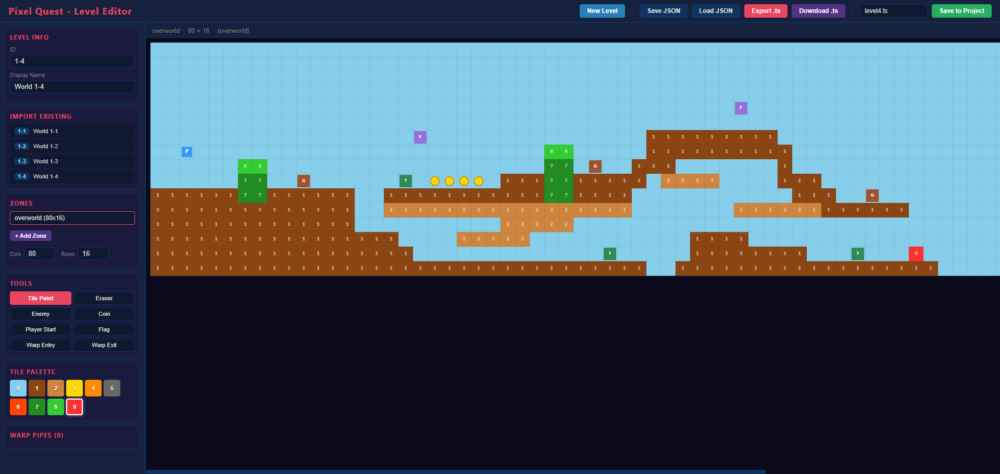

# Pixel Quest

A Super Mario Bros-inspired platformer built with React, TypeScript, and Vite. Pure CSS pixel art — no image assets or sprite sheets.


## 🎮 Controls

| Key | Action |
|-----|--------|
| **←** / **→** / **A** / **D** | Move left / right |
| **↓** / **S** | Crouch / Enter warp pipe |
| **Space** / **↑** / **W** | Jump (press again mid-air for double jump) |
| **F** | Shoot fireball (requires Fire Flower power-up) |
| **Enter** | Start game / Restart after win or game over |

## 🕹️ Gameplay

### Objective
Navigate through the level, collect coins, defeat enemies, and reach the flag pole at the end to win. Discover secret warp pipes to access hidden underground areas filled with bonus coins.

### Player Abilities
- **Walking & Running** — Move through the level with arrow keys
- **Jumping** — Press Space to jump; press again in mid-air for a **double jump**
- **Fireballs** — When the Fire Flower power-up is active, press F to shoot bouncing fireballs that defeat enemies on contact
- **Warp Pipes** — Stand on certain pipes and press **Down** to travel to secret underground areas

### Blocks
| Type | Description |
|------|-------------|
| **Ground** | Brown terrain blocks forming the level floor |
| **Bricks** | Breakable blocks (smash from below when big) |
| **? Blocks** | Hit from below to reveal coins or power-ups |
| **Multi-coin Blocks** | Dispense 5 coins on repeated hits, then shatter |
| **Solid Blocks** | Blue indestructible blocks |
| **Pipes** | Green pipes — some are warp pipes leading to secret areas |
| **Jump Pads** | Red spring-loaded pads that launch the player high into the air. Landing on one triggers a compress-then-launch animation (250ms hold) before the player is sprung upward |

### Power-ups
| Power-up | Effect |
|----------|--------|
| **Mushroom** | Makes Mario grow big; can break bricks |
| **Fire Flower** | Grants timed fireball ability (15s); changes Mario to white/red color scheme. Flashes when about to expire |

### Enemies
| Enemy | Behavior |
|-------|----------|
| **Goomba** | Walks back and forth on the ground. Defeat by jumping on top or with a fireball |
| **Flyer** | Moves around, bobbing up and down in the air. Defeat by jumping on top or with a fireball |
| **Turtle** | Patrols the ground. Jump on it to turn it into a fast-sliding shell. The shell rebounds off walls up to 3 times and destroys any enemies it hits. A sliding shell damages the player on contact. Jump on the sliding shell to destroy it. Fireballs also convert turtles into shells |

### Warp Pipes
Certain pipes in the level are warp pipes. Stand on top of them and press **Down** to enter. You'll be transported to a secret underground area with bonus coins and enemies. Find the exit pipe in the underground to return to the overworld further ahead in the level.

### Scoring
| Action | Points |
|--------|--------|
| Coin pickup | 100 |
| Power-up pickup | 500 |
| Enemy defeat | 100 |
| Flag pole | 1,000 |

### Flag Pole Sequence
When Mario reaches the flag pole, he grabs on and slides down with the flag. After landing, he auto-walks past the pole before the victory screen appears.

## 🏗️ Tech Stack

- **React 18** — Component-based UI
- **TypeScript** — Full type safety across the codebase
- **Vite** — Fast dev server and build tool
- **SCSS** — Styling with variables, mixins, and nesting
- **Pure CSS pixel art** — All characters, enemies, and objects are rendered with CSS (no images)

## 📷 Camera System

The camera handles both horizontal scrolling and vertical section transitions with different strategies for each axis.

### Horizontal Tracking
The camera centers on the player each frame and clamps to zone boundaries, preventing the viewport from showing empty space beyond the level edges.

### Vertical Section Snap
For levels that extend beyond the viewport height (12 tiles), the camera uses a snap-to-section model to hide lower rooms until discovered:
- While the player is in the top section, the camera holds at Y=0 — floor gaps appear bottomless
- When the player drops below the viewport boundary, the camera lerps smoothly to the lower section
- A 2-pixel ground probe ensures reliable ground contact detection even when the player's feet are perfectly flush with a tile surface

### Background Parallax
Cloud and hill background layers translate at a fraction of the camera speed, creating depth without additional rendering layers.

## 📁 Project Structure

```
src/
├── components/       # React components (Game, Player, Enemy, Coin, etc.)
├── config/
│   └── constants.ts  # Central game tuning (physics, sizes, timing)
├── data/
│   └── level1.ts     # Level maps (overworld + underground), enemy/coin spawns, warp pipes
├── hooks/
│   ├── useGameState.ts  # Core game logic (physics, collisions, zone management)
│   └── useInput.ts      # Keyboard input handling
├── styles/           # SCSS files for all components
└── utils/
    ├── collision.ts  # AABB overlap & penetration helpers
    └── physics.ts    # Zone-aware tile lookups & solid tile checks
```

## 🚀 Getting Started

```bash
# Install dependencies
npm install

# Start dev server
npm run dev

# Build for production
npm run build

# Preview production build
npm run preview
```

## �️ Level Editor

Pixel Quest includes a full visual level editor for creating and modifying game levels without hand-writing code.



### Accessing the Editor

The editor runs as a separate page in the same Vite project:

```bash
# Start the dev server (if not already running)
npm run dev

# Then navigate to:
# http://localhost:5173/editor.html
```

### Editor Features

| Tool | Description |
|------|-------------|
| **Tile Brush** | Paint any of 9 tile types: ground, bricks, ? blocks, power-up blocks, solid blocks, fire flower blocks, pipe bodies, pipe tops, and jump pads |
| **Eraser** | Remove tiles, enemies, and coins from the grid |
| **Enemy Tool** | Place Goombas, Flyers, or Turtles on the map |
| **Coin Tool** | Add collectible coins to the level |
| **Player Start** | Set Mario's spawn position (overworld only) |
| **Flag Tool** | Place the level end flag (overworld only) |
| **Warp Pipes** | Define entry and exit points for secret underground zones |

### Multi-Zone Level Design

Levels can contain multiple zones:
- **Overworld** — The main level area (always required)
- **Additional Zones** — Create custom underground or bonus rooms with independent dimensions

Switch between zones using the zone tabs. Resize zones dynamically — tiles, enemies, and coins outside the new bounds are automatically pruned.

### Creating Warp Pipes

1. Select the **Warp Entry** tool and click on a pipe in the overworld
2. Switch to the destination zone (or create a new one)
3. Select the **Warp Exit** tool and click where the pipe should lead
4. The editor automatically links the two points with full coordinates and emerge direction

### Saving Levels

The editor supports two export workflows:

#### Export to TypeScript File
Click **Export** to generate a complete TypeScript source file, or **Download** to save it directly. The exported file includes:
- Tile maps with column headers for readability
- Enemy spawn arrays with correct pixel positioning
- Coin coordinates
- Warp pipe definitions with entry/exit zones
- Fully typed `LevelDefinition` export ready to drop into `src/data/`

#### Save to Project (Hot Reload)
Click **Save to Project** to write the level directly into the source code and trigger instant hot-reload:

1. The editor generates TypeScript and POSTs it to a custom Vite plugin endpoint (`/api/save-level`)
2. The plugin writes the file to `src/data/` and auto-regenerates the `levels.ts` registry
3. Vite HMR picks up the changes — the game updates immediately without restart

When importing an existing game level, the editor queries the API to determine the original source filename, so re-saving overwrites the correct file rather than creating duplicates.

### Importing Levels

- **Import from Game** — Load any existing level from the game registry for modification
- **Load JSON** — Import previously exported level JSON files

Both methods auto-populate the save filename so the round-trip (import → edit → save → playtest) takes seconds.

## 📐 Game Constants

Key values can be tuned in `src/config/constants.ts`:

- **Viewport**: 960×576px (responsive scaling on smaller screens)
- **Tile size**: 48×48px
- **Jump force**: -14 (double jump: -11)
- **Player speed**: 4.5 px/frame
- **Fire power duration**: 15 seconds
- **Multi-coin blocks**: 5 coins each
- **Starting lives**: 3

## 📱 Responsive

The game automatically scales down to fit smaller screens while maintaining the native 960×576 resolution. The internal game logic is unaffected — only the visual display scales.


## 🖼️ Screenshots


